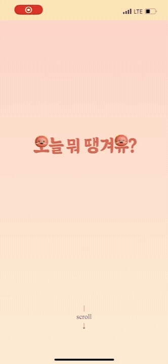
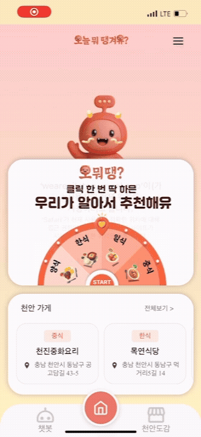
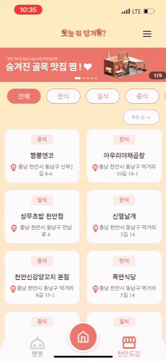
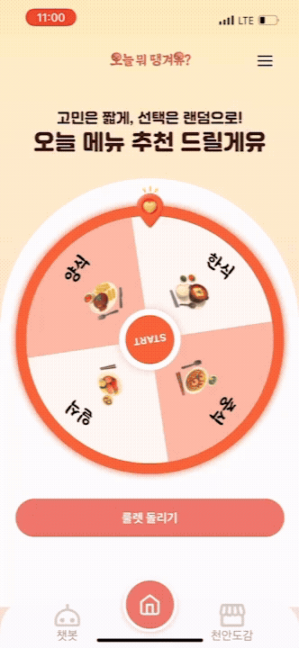
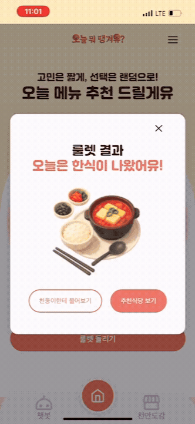
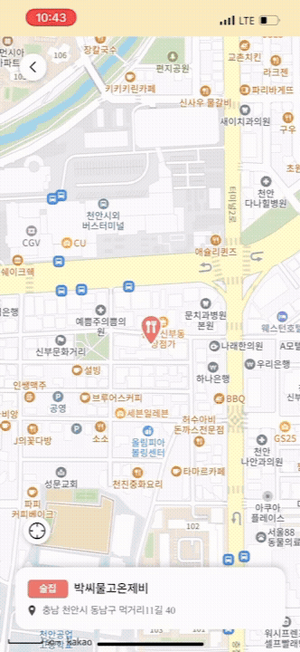
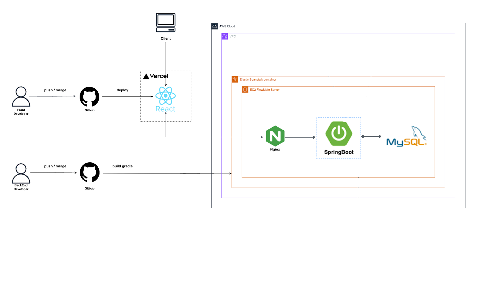

# 오뭐땡?

  
   

<b>오</b>늘 <b>뭐 </b><b>땡</b>겨유<b>?

## 🧑‍🏫 프로젝트 소개

<h2>천안 시민과 천안시 대학생의 AI한 한 끼를 위한 밥상 도우미</h2>

"오늘 뭐 먹지?"라는 고민으로 시작해, 상권이 밀집되어 있어 상권 불균형을 해결하고, 자신의 소비 성향에 맞는 곳을 찾기 위해 다른 지역의 정보를 탐색해야 하는 천안 시민과 대학생의 불편함을 해결하고자 합니다.

## 주요 기능

### 1. 룰렛

- 룰렛을 돌리면 멈추는 카테고리에 만족할 시 거리순으로 식당 목록을 보여주고 추천을 더 받고 싶을시 AI천둥이로 이동하게 됩니다.
- 메뉴 결정에 어려움을 느끼는 사용자의 고민 시간을 단축시키고, 선택 과정을 게임처럼 즐거운 경험으로 전환합니다.
- 추천 식당 목록 페이지 상단에 광고 노출로 소상공인에게는 잠재 고객을 만날 기회를 유료로 제공합니다.

### 2. AI 천둥이

- 사용자가 원하는 메뉴나 상황을 입력하면 해당 조건에 가장 부합한 식당 리스트를 추천받는 대화형 AI 인터페이스입니다.
- 복잡한 필터링 과정 없이, 대화하듯 친근하고 편리하게 구체적인 요구사항에 맞는 식당을 추천받아 높은 만족도를 경험하게 됩니다.

### 3. 천안 도감

- 룰렛과 챗봇으로도 해결되지 않는 깊은 탐색을 원한다면, 여러 카테고리별로 천안시에 있는 식당과 사용자의 현재 위치의 거리순으로 확인 할 수 있습니다.
- 소상공인은 별도의 광고 없이 사용자에게 노출함으로써 효과적으로 홍보할 기회를 얻습니다.

## 기대 효과

- 메뉴 결정의 즐거움과 효율성 증대 -상권 활기 순환 -이용자와 소상공인의 상생 구조 구축

‘오늘 뭐 먹어유’는 단순히 맛집 정보를 제공하는 것을 넘어, 지역 사회에 긍정적인 가치를 창출하는 것을 목표를 한다.

<a href="https://wearepitstop.vercel.app"><b>배포 링크</b></a>

<a href="public/assets/your-ppt.pdf"  target="_blank" ><b>피피티</b></a>

## 🙋🏻‍♀️ Our Teams

  <table>
    <tr>
      <th align="center">기획</th>
      <th align="center">기획</th>
      <th align="center">디자인</th>
      <th align="center">프론트엔드</th>
        <th align="center">백엔드</th>
          <th align="center">백엔드</th>
    </tr>
    <tr>
      <td align="center">이유정</td>
      <td align="center">정혜영</td>
      <td align="center">장하늘</td>
      <td align="center">오다현</td>
          <td align="center">김양현</td>
              <td align="center">황윤성</td>
    </tr>
    <tr>
      <td></td>
      <td></td>
      <td></td>
      <td></td>
      <td></td>
      <td></td>
    </tr>
    <tr>
      <td align="center"><a href="https://github.com/2ujeong">:link: Github</a></td>
      <td align="center"><a href="https://github.com/hyeyoung04">:link: Github</a></td>
      <td align="center"><a href="https://github.com/ddingddangddong">:link: Github</a></td>
      <td align="center"><a href="https://github.com/dahyuniiiiii">:link: Github</a></td>
      <td align="center"><a href="https://github.com/rladidgus">:link: Github</a></td>
      <td align="center"><a href="https://github.com/hys0126">:link: Github</a></td>
    </tr>
  </table>

## 🧑‍💻 Tech Stacks

<h3>[ Frontend ]</h3>

 <h3>[ Backend ]</h3>

## 🖥 SCREENS

<table>
  <tr>
    <td align="center"><strong>온보딩</strong></td>
    <td align="center"><strong>메인</strong></td>
  </tr>
  <tr>
    <td></td>
    <td></td>
  </tr>
  <tr>
    <td align="center"><strong>천안도감</strong></td>
    <td align="center"><strong>챗봇</strong></td>
  </tr>
  <tr>
    <td></td>
    <td></td>
  </tr>
  <tr>
    <td align="center"><strong>룰렛</strong></td>
    <td align="center"><strong>룰렛 결과</strong></td>
  </tr>
  <tr>
    <td></td>
    <td></td>
  </tr>
  <tr>
    <td align="center"><strong>식당상세정보</strong></td>
    <td align="center"><strong>지도</strong></td>
  </tr>
  <tr>
    <td align= "center"></td>
    <td></td>
  </tr>
</table>

## 💻 시스템아키텍쳐

  
   

## 🧩 플로우차트

  
   

